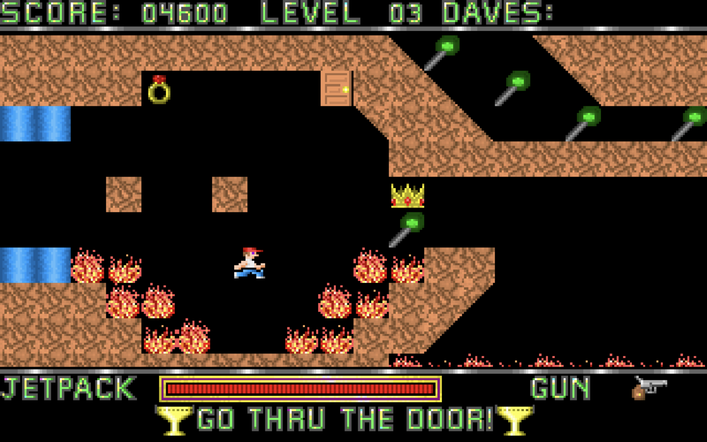

# Dangerous Dave
This is a replica of the classic game Dangerous Dave, built using the C programming language and the SDL (Simple DirectMedia Layer) library. It aims to recreate the nostalgic gameplay experience of the original while adding some modern twists.

## Build Notes

#### You must have SDL2 installed on your system and know how to include in your project
i.e. gcc -I/usr/include/SDL2 lmdave.c -Wall -lSDL2 -o lmdave

clang -std=c11 LEVEL.c TILES.c lmdave.c -I/Library/Frameworks/SDL2.framework/Headers -I/Library/Frameworks/SDL2_image.framework/Headers -F/Library/Frameworks -framework SDL2 -framework SDL2_image -o app

#### You must have access to the original Dangerous Dave binary and extract the assets yourself
Use the included TILES.c and LEVEL.c
